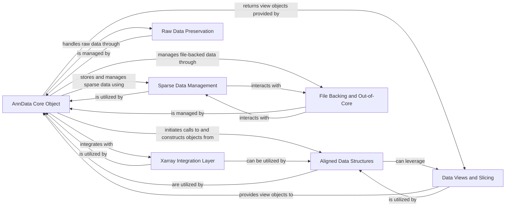

## Details

Analysis of the AnnData Core Model subsystem, which embodies the Data-Centric Architecture pattern and provides a unified, high-level interface for users to interact with complex multi-dimensional annotated datasets.

### AnnData Core Object

The central `AnnData` object (`anndata._core.anndata.AnnData`) serves as the primary data container and facade. It aggregates and orchestrates access to all other data components (main data matrix, observations, variables, layers, etc.), providing a consistent API for users.

**Related Classes/Methods**:

- <a href="https://github.com/scverse/anndata/blob/main/src/anndata/_core/anndata.py#L1-L1" target="_blank" rel="noopener noreferrer">`anndata._core.anndata.AnnData` (1:1)</a>

### Aligned Data Structures

This component (`anndata._core.aligned_mapping`) manages the synchronized storage and access of multi-dimensional annotations such as `obs`, `var`, `layers`, `obsm`, `varm`, and `uns`. It ensures that all these data frames and mappings are consistently indexed and aligned with the main data matrix.

**Related Classes/Methods**:

- <a href="https://github.com/scverse/anndata/blob/main/src/anndata/_core/aligned_mapping.py#L1-L1" target="_blank" rel="noopener noreferrer">`anndata._core.aligned_mapping` (1:1)</a>

### Sparse Data Management

Provides efficient handling for sparse matrices (`anndata._core.sparse_dataset`), which are crucial for memory optimization and performance when dealing with large biological datasets (e.g., single-cell RNA-seq data). It includes classes for backed and in-memory sparse representations.

**Related Classes/Methods**:

- <a href="https://github.com/scverse/anndata/blob/main/src/anndata/_core/sparse_dataset.py#L1-L1" target="_blank" rel="noopener noreferrer">`anndata._core.sparse_dataset` (1:1)</a>

### Data Views and Slicing

This component (`anndata._core.views`) enables memory-efficient access to subsets or transformed views of the AnnData object without creating full copies of the data. It provides various view objects for different data types (arrays, dataframes, sparse matrices).

**Related Classes/Methods**:

- <a href="https://github.com/scverse/anndata/blob/main/src/anndata/_core/views.py#L1-L1" target="_blank" rel="noopener noreferrer">`anndata._core.views` (1:1)</a>

### File Backing and Out-of-Core

Manages the interaction between in-memory AnnData objects and on-disk storage (`anndata._core.file_backing`), enabling the handling of datasets larger than available RAM (out-of-core computation). It facilitates lazy loading and efficient data retrieval from disk.

**Related Classes/Methods**:

- <a href="https://github.com/scverse/anndata/blob/main/src/anndata/_core/file_backing.py#L1-L1" target="_blank" rel="noopener noreferrer">`anndata._core.file_backing` (1:1)</a>

### Raw Data Preservation

Manages the `raw` attribute of an AnnData object (`anndata._core.raw`), providing a mechanism to store an immutable, unnormalized, or unprocessed version of the main data matrix and its associated annotations.

**Related Classes/Methods**:

- <a href="https://github.com/scverse/anndata/blob/main/src/anndata/_core/raw.py#L1-L1" target="_blank" rel="noopener noreferrer">`anndata._core.raw` (1:1)</a>

### Xarray Integration Layer

Facilitates interoperability with `xarray` data structures (`anndata._core.xarray`), bridging AnnData's internal representation with `xarray`'s labeled multi-dimensional arrays. This allows leveraging `xarray`'s powerful capabilities for array manipulation and computation.

**Related Classes/Methods**:

- <a href="https://github.com/scverse/anndata/blob/main/src/anndata/_core/xarray.py#L1-L1" target="_blank" rel="noopener noreferrer">`anndata._core.xarray` (1:1)</a>

### [FAQ](https://github.com/CodeBoarding/GeneratedOnBoardings/tree/main?tab=readme-ov-file#faq)