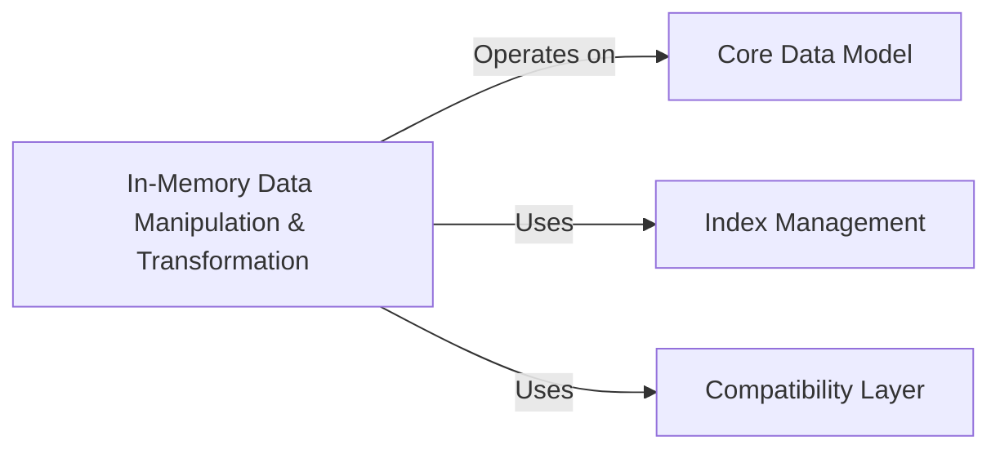

## Details

Analysis of the 'In-Memory Data Manipulation & Transformation' component within a Scientific Data Management Library, detailing its functionalities, key methods, and relationships with 'Core Data Model', 'Index Management', and 'Compatibility Layer' components.

### In-Memory Data Manipulation & Transformation

This component provides core functionalities for in-memory data transformations, including combining, merging, and concatenating multiple AnnData objects or their internal components. It ensures proper index alignment and data type unification during these operations. It handles various data types, including NumPy arrays, Pandas DataFrames/Series, Dask arrays, CuPy arrays, and sparse matrices.

**Related Classes/Methods**:

- <a href="https://github.com/scverse/anndata/blob/main/src/anndata/_core/merge.py" target="_blank" rel="noopener noreferrer">`anndata._core.merge.equal`</a>

- <a href="https://github.com/scverse/anndata/blob/main/src/anndata/_core/merge.py" target="_blank" rel="noopener noreferrer">`anndata._core.merge.union_keys`</a>

- <a href="https://github.com/scverse/anndata/blob/main/src/anndata/_core/merge.py" target="_blank" rel="noopener noreferrer">`anndata._core.merge.intersect_keys`</a>

- <a href="https://github.com/scverse/anndata/blob/main/src/anndata/_core/anndata.py" target="_blank" rel="noopener noreferrer">`anndata._core.anndata.AnnData._concat`</a>

### Core Data Model

The central data structure around which all data manipulation and transformation operations revolve, ensuring consistency and manageability.

**Related Classes/Methods**: _None_

### Index Management

Ensures correct sample and feature identities across datasets by aligning corresponding metadata and data points during data combination, merging, or concatenation.

**Related Classes/Methods**: _None_

### Compatibility Layer

Abstracts away differences in various data formats and libraries (NumPy, Pandas, SciPy, Dask, CuPy), enabling uniform operation of core data manipulation logic.

**Related Classes/Methods**: _None_

### [FAQ](https://github.com/CodeBoarding/GeneratedOnBoardings/tree/main?tab=readme-ov-file#faq)