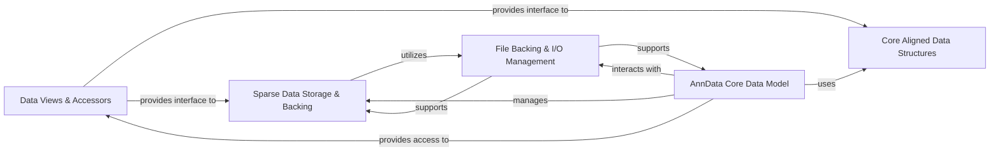

## Details

This component is fundamental to `anndata`'s "Data-Centric Architecture" and "Modular Design," providing the core mechanisms for efficient data representation, storage, and access. It ensures data integrity and optimizes memory usage, which is crucial for handling large-scale biological datasets.

### Core Aligned Data Structures

This component provides the foundational data structures (`AlignedActual`, `AxisArrays`, `Layers`, `PairwiseArrays`) for organizing and aligning various data matrices within the AnnData object. It ensures consistent indexing across different data components (e.g., observations, variables, layers, embeddings), which is central to maintaining data integrity and facilitating integrated analysis.

**Related Classes/Methods**:

- <a href="https://github.com/scverse/anndata/blob/main/src/anndata/_core/aligned_mapping.py#L201-L230" target="_blank" rel="noopener noreferrer">`anndata._core.aligned_mapping.AlignedActual` (201:230)</a>

- <a href="https://github.com/scverse/anndata/blob/main/src/anndata/_core/aligned_mapping.py#L290-L301" target="_blank" rel="noopener noreferrer">`anndata._core.aligned_mapping.AxisArrays` (290:301)</a>

- <a href="https://github.com/scverse/anndata/blob/main/src/anndata/_core/aligned_mapping.py#L323-L324" target="_blank" rel="noopener noreferrer">`anndata._core.aligned_mapping.Layers` (323:324)</a>

- <a href="https://github.com/scverse/anndata/blob/main/src/anndata/_core/aligned_mapping.py#L361-L372" target="_blank" rel="noopener noreferrer">`anndata._core.aligned_mapping.PairwiseArrays` (361:372)</a>

### Data Views & Accessors

This component offers read-only or controlled access mechanisms (`ArrayView`, `DataFrameView`, `SparseCSRMatrixView`, `_ViewMixin`) to the underlying data arrays and dataframes. It optimizes memory usage by avoiding unnecessary data copies and ensures data integrity by providing controlled, immutable access, aligning with the "Proxy Pattern."

**Related Classes/Methods**:

- <a href="https://github.com/scverse/anndata/blob/main/src/anndata/_core/views.py#L105-L169" target="_blank" rel="noopener noreferrer">`anndata._core.views.ArrayView` (105:169)</a>

- <a href="https://github.com/scverse/anndata/blob/main/src/anndata/_core/views.py#L268-L289" target="_blank" rel="noopener noreferrer">`anndata._core.views.DataFrameView` (268:289)</a>

- <a href="https://github.com/scverse/anndata/blob/main/src/anndata/_core/views.py#L209-L212" target="_blank" rel="noopener noreferrer">`anndata._core.views.SparseCSRMatrixView` (209:212)</a>

- <a href="https://github.com/scverse/anndata/blob/main/src/anndata/_core/views.py#L84-L99" target="_blank" rel="noopener noreferrer">`anndata._core.views._ViewMixin` (84:99)</a>

### Sparse Data Storage & Backing

This component manages the efficient storage and retrieval of sparse matrices (`BaseCompressedSparseDataset`, `_CSCDataset`, `_CSRDataset`, `backed_csc_matrix`, `backed_csr_matrix`), including mechanisms for backed (out-of-core) access from disk. This is vital for handling the large, sparse datasets common in single-cell genomics, directly supporting the "Data Storage/Persistence" and "Data Access/Manipulation" patterns.

**Related Classes/Methods**:

- <a href="https://github.com/scverse/anndata/blob/main/src/anndata/_core/sparse_dataset.py" target="_blank" rel="noopener noreferrer">`anndata._core.sparse_dataset.BaseCompressedSparseDataset`</a>

- <a href="https://github.com/scverse/anndata/blob/main/src/anndata/_core/sparse_dataset.py" target="_blank" rel="noopener noreferrer">`anndata._core.sparse_dataset._CSCDataset`</a>

- <a href="https://github.com/scverse/anndata/blob/main/src/anndata/_core/sparse_dataset.py" target="_blank" rel="noopener noreferrer">`anndata._core.sparse_dataset._CSRDataset`</a>

- <a href="https://github.com/scverse/anndata/blob/main/src/anndata/_core/sparse_dataset.py" target="_blank" rel="noopener noreferrer">`anndata._core.sparse_dataset.backed_csc_matrix`</a>

- <a href="https://github.com/scverse/anndata/blob/main/src/anndata/_core/sparse_dataset.py" target="_blank" rel="noopener noreferrer">`anndata._core.sparse_dataset.backed_csr_matrix`</a>

### AnnData Core Data Model

The central data model (`AnnData` class) that encapsulates and orchestrates all other data structures and views, providing a unified, high-level interface for single-cell omics data. It integrates the aligned mappings, sparse datasets, and views into a cohesive, user-friendly object, acting as the "Core Data Model" and "Facade" for the library.

**Related Classes/Methods**:

- <a href="https://github.com/scverse/anndata/blob/main/src/anndata/_core/anndata.py" target="_blank" rel="noopener noreferrer">`anndata._core.anndata.AnnData`</a>

### File Backing & I/O Management

This component handles the persistence and lazy loading of AnnData objects to and from disk, primarily using HDF5 and Zarr formats. It manages file handles and ensures efficient out-of-core I/O operations for large datasets, directly implementing the "Data Storage/Persistence (I/O)" layer.

**Related Classes/Methods**:

- <a href="https://github.com/scverse/anndata/blob/main/src/anndata/_core/file_backing.py#L23-L119" target="_blank" rel="noopener noreferrer">`anndata._core.file_backing.AnnDataFileManager` (23:119)</a>

- <a href="https://github.com/scverse/anndata/blob/main/src/anndata/experimental/backed/_lazy_arrays.py#L34-L52" target="_blank" rel="noopener noreferrer">`anndata.experimental.backed._lazy_arrays.ZarrOrHDF5Wrapper` (34:52)</a>

### [FAQ](https://github.com/CodeBoarding/GeneratedOnBoardings/tree/main?tab=readme-ov-file#faq)