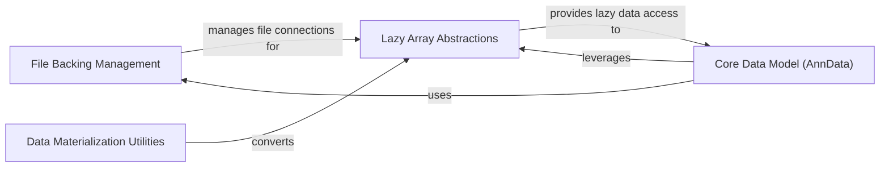

## Details

The `File Backing & Lazy Loading` subsystem is fundamental for AnnData's ability to handle large datasets that exceed available memory, aligning perfectly with the "Scientific Data Management Library" project type's emphasis on efficient data persistence and out-of-core computation. This subsystem achieves its purpose through three core components:

### File Backing Management

This component is responsible for establishing and managing the direct connection to on-disk HDF5 files that back AnnData objects. It provides the low-level interface for opening, closing, and accessing data within these files, acting as the primary gateway for persistent storage interactions. It ensures data integrity and efficient I/O operations for out-of-core datasets.

**Related Classes/Methods**:

- `AnnDataFileManager`

### Lazy Array Abstractions

This component provides a set of specialized array wrappers that enable lazy loading and out-of-core computation for various data types (dense, categorical, masked) stored on disk. These wrappers abstract the underlying file format (HDF5 or Zarr) and present a unified, array-like interface, fetching data chunks only when they are explicitly accessed. This minimizes memory footprint and allows for processing datasets larger than RAM.

**Related Classes/Methods**:

- `ZarrOrHDF5Wrapper`

- `CategoricalArray`

- `MaskedArray`

### Data Materialization Utilities

This component provides a set of utility functions designed to explicitly convert disk-backed (lazy) data structures into their in-memory representations. This is crucial for operations that require the entire dataset to reside in memory, or for transitioning from out-of-core processing to in-memory analysis. It handles various array types, ensuring a seamless conversion process.

**Related Classes/Methods**:

- `to_memory`

### Core Data Model (AnnData)

Represents the central AnnData object, which integrates various data structures and functionalities for single-cell omics data.

**Related Classes/Methods**: _None_

### [FAQ](https://github.com/CodeBoarding/GeneratedOnBoardings/tree/main?tab=readme-ov-file#faq)