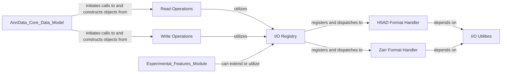

## Details

The I/O Management component in anndata is crucial for data persistence and interoperability within the scientific data management library. It adheres to the "Data Storage/Persistence" architectural pattern by providing a flexible and extensible framework for handling various data formats.

### I/O Registry

This component acts as the central hub for registering and managing read and write methods for different data formats. It uses a registry pattern to allow for dynamic dispatch of I/O operations, making the system highly extensible. It includes IORegistry, Reader, Writer, and LazyReader classes.

**Related Classes/Methods**:

- <a href="https://github.com/scverse/anndata/blob/main/src/anndata/_io/specs/registry.py" target="_blank" rel="noopener noreferrer">`anndata._io.specs.registry`</a>

- <a href="https://github.com/scverse/anndata/blob/main/src/anndata/_io/specs/registry.py#L89-L216" target="_blank" rel="noopener noreferrer">`anndata._io.specs.registry:IORegistry` (89:216)</a>

- <a href="https://github.com/scverse/anndata/blob/main/src/anndata/_io/specs/registry.py#L266-L287" target="_blank" rel="noopener noreferrer">`anndata._io.specs.registry:Reader` (266:287)</a>

- <a href="https://github.com/scverse/anndata/blob/main/src/anndata/_io/specs/registry.py#L321-L399" target="_blank" rel="noopener noreferrer">`anndata._io.specs.registry:Writer` (321:399)</a>

- <a href="https://github.com/scverse/anndata/blob/main/src/anndata/_io/specs/registry.py#L290-L318" target="_blank" rel="noopener noreferrer">`anndata._io.specs.registry:LazyReader` (290:318)</a>

### H5AD Format Handler

This component is responsible for the serialization and deserialization of AnnData objects to and from the H5AD format, which is a specialized HDF5-based format for single-cell data. It handles the intricacies of mapping AnnData's internal structure to HDF5 groups and datasets.

**Related Classes/Methods**:

- <a href="https://github.com/scverse/anndata/blob/main/src/anndata/_io/h5ad.py" target="_blank" rel="noopener noreferrer">`anndata._io.h5ad`</a>

### Zarr Format Handler

This component provides support for reading and writing AnnData objects using the Zarr format. Zarr is a cloud-friendly, chunked, and compressed array format, enabling efficient out-of-core computation and distributed data handling.

**Related Classes/Methods**:

- <a href="https://github.com/scverse/anndata/blob/main/src/anndata/_io/zarr.py" target="_blank" rel="noopener noreferrer">`anndata._io.zarr`</a>

### Read Operations

This component provides high-level functions for reading AnnData objects from various file formats. It leverages the IORegistry to dispatch to the appropriate format-specific reader (e.g., H5AD, Zarr, CSV, Loom) based on the file extension or explicit format specification.

**Related Classes/Methods**:

- <a href="https://github.com/scverse/anndata/blob/main/src/anndata/_io/read.py" target="_blank" rel="noopener noreferrer">`anndata._io.read`</a>

### Write Operations

Similar to read operations, this component offers high-level functions for writing AnnData objects to different file formats. It interacts with the IORegistry to select and execute the correct writer for the specified format.

**Related Classes/Methods**:

- <a href="https://github.com/scverse/anndata/blob/main/src/anndata/_io/write.py" target="_blank" rel="noopener noreferrer">`anndata._io.write`</a>

### I/O Utilities

This component contains helper functions and utilities used across different I/O operations. This might include functions for path handling, data type conversions, or other common tasks that support the reading and writing processes.

**Related Classes/Methods**:

- <a href="https://github.com/scverse/anndata/blob/main/src/anndata/_io/utils.py" target="_blank" rel="noopener noreferrer">`anndata._io.utils`</a>

### [FAQ](https://github.com/CodeBoarding/GeneratedOnBoardings/tree/main?tab=readme-ov-file#faq)