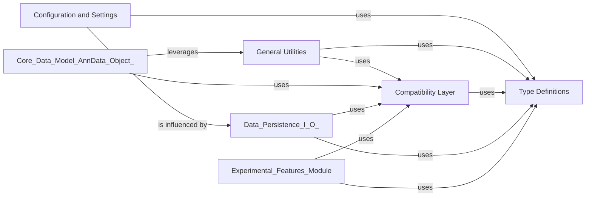

## Details

This subsystem is crucial for providing foundational support, ensuring adaptability, and maintaining code quality across the `anndata` library. It encapsulates general-purpose functionalities, manages global configurations, and handles interoperability with external scientific computing libraries.

### Configuration and Settings

This component provides a centralized mechanism for managing global settings and configurations that influence `anndata`'s behavior, such as default I/O formats, sparse matrix handling, and environment variable overrides. It acts as a single source of truth for configurable aspects of the library, allowing for flexible adaptation without modifying core logic.

**Related Classes/Methods**:

- <a href="https://github.com/scverse/anndata/blob/main/src/anndata/_settings.py#L1-L1" target="_blank" rel="noopener noreferrer">`anndata/_settings.py` (1:1)</a>

### General Utilities

This component provides a collection of general-purpose helper functions used across different parts of the `anndata` library. These utilities often deal with array conversions, type checking, memory usage reporting, deprecation warnings, and other common data manipulation tasks that are not specific to the `AnnData` object's core structure.

**Related Classes/Methods**:

- <a href="https://github.com/scverse/anndata/blob/main/src/anndata/utils.py#L1-L1" target="_blank" rel="noopener noreferrer">`anndata/utils.py` (1:1)</a>

- <a href="https://github.com/scverse/anndata/blob/main/src/anndata/_warnings.py#L1-L1" target="_blank" rel="noopener noreferrer">`anndata/_warnings.py` (1:1)</a>

### Compatibility Layer

This component provides functions and classes to ensure compatibility with different versions of external numerical and data manipulation libraries (e.g., `numpy`, `scipy`, `pandas`, `h5py`, `zarr`, `xarray`, `dask`, `cupy`, `pytorch`). It acts as an adapter to bridge potential inconsistencies or provide unified interfaces for diverse external data structures, crucial for interoperability in a scientific data management library.

**Related Classes/Methods**:

- <a href="https://github.com/scverse/anndata/blob/main/src/anndata/compat/__init__.py#L1-L1" target="_blank" rel="noopener noreferrer">`anndata/compat/__init__.py` (1:1)</a>

### Type Definitions

This component centralizes all custom type hints and definitions used throughout the `anndata` library. Its purpose is to ensure consistency in type annotations, improve code readability, facilitate static analysis, and enhance developer experience by providing clear data structure contracts.

**Related Classes/Methods**:

- <a href="https://github.com/scverse/anndata/blob/main/src/anndata/_types.py#L1-L1" target="_blank" rel="noopener noreferrer">`anndata/_types.py` (1:1)</a>

- <a href="https://github.com/scverse/anndata/blob/main/src/anndata/typing.py#L1-L1" target="_blank" rel="noopener noreferrer">`anndata/typing.py` (1:1)</a>

### [FAQ](https://github.com/CodeBoarding/GeneratedOnBoardings/tree/main?tab=readme-ov-file#faq)