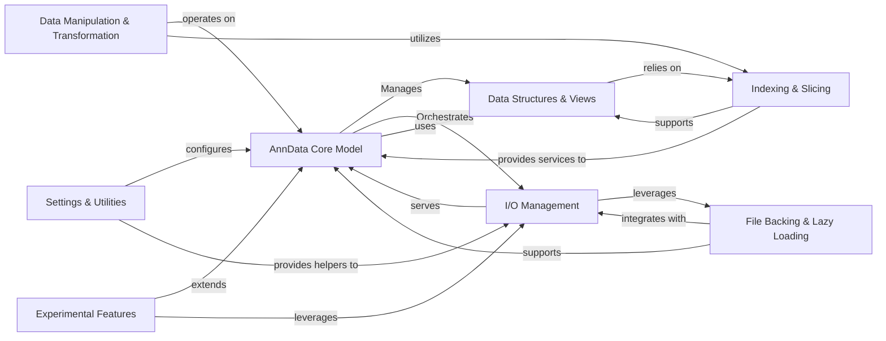

## Details

The anndata library is architected as a Scientific Data Management Library, prioritizing a robust, centralized data model with efficient I/O and data manipulation capabilities. The architecture is modular, allowing for extensibility and performance optimization, particularly for large and sparse datasets.

### AnnData Core Model [[Expand]](./AnnData_Core_Model.md)

The central AnnData object, serving as the primary interface for users to manage and interact with multi-dimensional annotated data. It acts as a facade, simplifying access to complex underlying data structures and orchestrating operations across various components.

**Related Classes/Methods**:

- <a href="https://github.com/scverse/anndata/blob/main/benchmarks/benchmarks/anndata.py#L1-L1" target="_blank" rel="noopener noreferrer">`anndata` (1:1)</a>

### Data Structures & Views [[Expand]](./Data_Structures_Views.md)

Provides the foundational data structures (e.g., AlignedMappingProperty, Layers, AxisArrays) and efficient storage mechanisms for sparse and dense data within the AnnData object. It also offers read-only views to ensure data integrity and optimize memory usage.

**Related Classes/Methods**:

- <a href="https://github.com/scverse/anndata/blob/main/src/anndata/_core/aligned_mapping.py#L1-L1" target="_blank" rel="noopener noreferrer">`aligned_mapping` (1:1)</a>

- <a href="https://github.com/scverse/anndata/blob/main/benchmarks/benchmarks/sparse_dataset.py#L1-L1" target="_blank" rel="noopener noreferrer">`sparse_dataset` (1:1)</a>

- <a href="https://github.com/scverse/anndata/blob/main/src/anndata/_core/views.py#L1-L1" target="_blank" rel="noopener noreferrer">`views` (1:1)</a>

- <a href="https://github.com/scverse/anndata/blob/main/src/anndata/_core/xarray.py#L1-L1" target="_blank" rel="noopener noreferrer">`xarray` (1:1)</a>

### I/O Management [[Expand]](./I_O_Management.md)

A comprehensive layer responsible for registering, dispatching, and executing read/write operations for various data formats (H5AD, Zarr, CSV, Loom). It handles data serialization/deserialization and supports lazy loading, acting as the primary interface for data persistence.

**Related Classes/Methods**:

- <a href="https://github.com/scverse/anndata/blob/main/src/anndata/_io/specs/registry.py#L1-L1" target="_blank" rel="noopener noreferrer">`registry` (1:1)</a>

- <a href="https://github.com/scverse/anndata/blob/main/src/anndata/_io/specs/methods.py#L1-L1" target="_blank" rel="noopener noreferrer">`methods` (1:1)</a>

- <a href="https://github.com/scverse/anndata/blob/main/src/anndata/_io/specs/lazy_methods.py#L1-L1" target="_blank" rel="noopener noreferrer">`lazy_methods` (1:1)</a>

- <a href="https://github.com/scverse/anndata/blob/main/src/anndata/_io/h5ad.py#L1-L1" target="_blank" rel="noopener noreferrer">`h5ad` (1:1)</a>

- <a href="https://github.com/scverse/anndata/blob/main/src/anndata/_io/zarr.py#L1-L1" target="_blank" rel="noopener noreferrer">`zarr` (1:1)</a>

- <a href="https://github.com/scverse/anndata/blob/main/src/anndata/_io/read.py#L1-L1" target="_blank" rel="noopener noreferrer">`read` (1:1)</a>

### Data Manipulation & Transformation [[Expand]](./Data_Manipulation_Transformation.md)

Provides core functionalities for in-memory data transformations, including combining, merging, and concatenating multiple AnnData objects or their internal components. It ensures proper index alignment and data type unification during these operations.

**Related Classes/Methods**:

- <a href="https://github.com/scverse/anndata/blob/main/src/anndata/experimental/merge.py#L1-L1" target="_blank" rel="noopener noreferrer">`merge` (1:1)</a>

### File Backing & Lazy Loading [[Expand]](./File_Backing_Lazy_Loading.md)

Manages the on-disk representation of AnnData objects, enabling out-of-core computation and lazy loading of data. This component is crucial for efficiently handling datasets that exceed available memory, by providing mechanisms to access data directly from disk.

**Related Classes/Methods**:

- <a href="https://github.com/scverse/anndata/blob/main/src/anndata/_core/file_backing.py#L1-L1" target="_blank" rel="noopener noreferrer">`file_backing` (1:1)</a>

- <a href="https://github.com/scverse/anndata/blob/main/src/anndata/experimental/backed/_lazy_arrays.py#L1-L1" target="_blank" rel="noopener noreferrer">`_lazy_arrays` (1:1)</a>

### Indexing & Slicing

Offers fundamental utilities for normalizing and applying various types of indices (e.g., integer, boolean, label-based) for efficient data access, subsetting, and alignment within AnnData objects and their internal components.

**Related Classes/Methods**:

- <a href="https://github.com/scverse/anndata/blob/main/src/anndata/_core/index.py#L1-L1" target="_blank" rel="noopener noreferrer">`index` (1:1)</a>

### Settings & Utilities [[Expand]](./Settings_Utilities.md)

A collection of general-purpose helper functions, including array conversions, memory usage reporting, deprecation warnings, and I/O-specific helpers. It also manages global configuration settings and provides a compatibility layer for external numerical libraries.

**Related Classes/Methods**:

- <a href="https://github.com/scverse/anndata/blob/main/benchmarks/benchmarks/utils.py#L1-L1" target="_blank" rel="noopener noreferrer">`utils` (1:1)</a>

- <a href="https://github.com/scverse/anndata/blob/main/benchmarks/benchmarks/utils.py#L1-L1" target="_blank" rel="noopener noreferrer">`utils` (1:1)</a>

- <a href="https://github.com/scverse/anndata/blob/main/src/anndata/_settings.py#L1-L1" target="_blank" rel="noopener noreferrer">`_settings` (1:1)</a>

- `compat` (1:1)

### Experimental Features

A dedicated module for new and experimental functionalities, such as advanced merging strategies, multi-file handling, and integrations with deep learning frameworks. This allows for agile development and testing without impacting the stability of the core library.

**Related Classes/Methods**:

- <a href="https://github.com/scverse/anndata/blob/main/src/anndata/experimental/merge.py#L1-L1" target="_blank" rel="noopener noreferrer">`merge` (1:1)</a>

- <a href="https://github.com/scverse/anndata/blob/main/src/anndata/experimental/multi_files/_anncollection.py#L1-L1" target="_blank" rel="noopener noreferrer">`_anncollection` (1:1)</a>

- <a href="https://github.com/scverse/anndata/blob/main/src/anndata/experimental/pytorch/_annloader.py#L1-L1" target="_blank" rel="noopener noreferrer">`_annloader` (1:1)</a>

### [FAQ](https://github.com/CodeBoarding/GeneratedOnBoardings/tree/main?tab=readme-ov-file#faq)